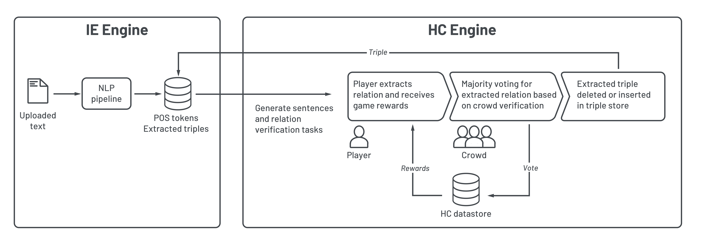

 

# Manual Triple Extraction Tool
With Treption (a-lack-of-inspiration-temporarily-working-name) we propose a system that enables semantic triple generation by adding a gamified layer on top of existing automatic Relation Extraction systems (Research in progress). 

## Setup 
1. Install the latest version of [Docker](https://docs.docker.com/install/)
2. Open the project folder in a terminal of your choice
3. enter `docker-compose up --build`
4. To enable triple storage in Apache Jena Fuseki, open `http://localhost:3030` and create a `Treption` dataset (To be automated).
5. Open the application in your browser at `http://localhost:5000` to start extracting!

## System design 

## Background (In progress)
Manual relation extraction (RE) can boost performance of semantic models. However, manual RE can become a laborious and tedious task. Furthermore, Burghardt [6] argues that usability has significant impact on the process of extraction. Based on these challenges, this project tends to come up with an attractive and assisting way to extract relations manually.

## Troubleshooting (In progress)
1. Check whether the Docker containers are running by entering `Docker ps` in your terminal
2. Are the required ports (`3000`, `3306`, `3030`, `5000`, `9000`) available?